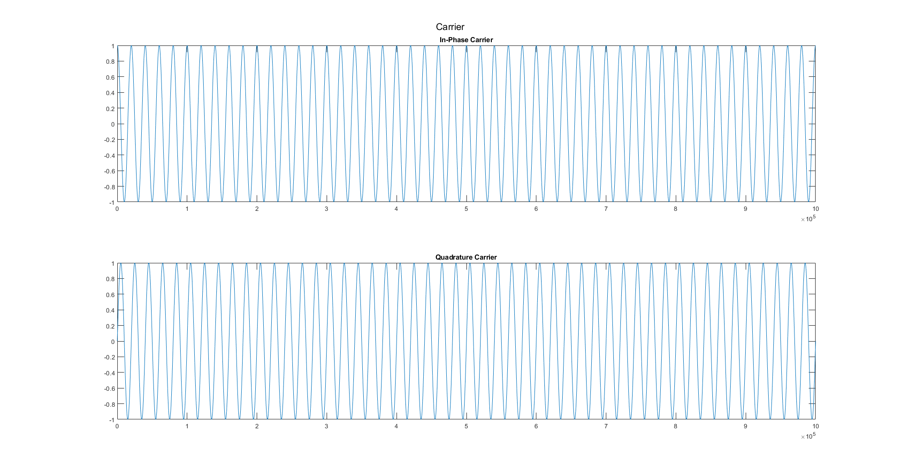
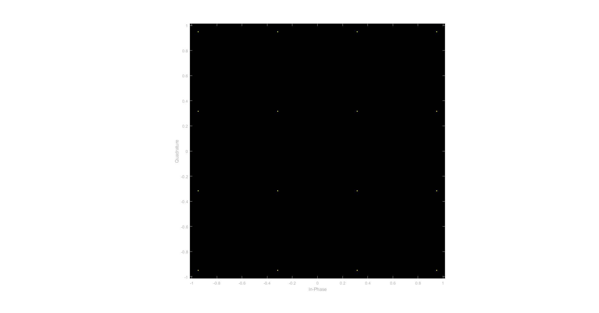
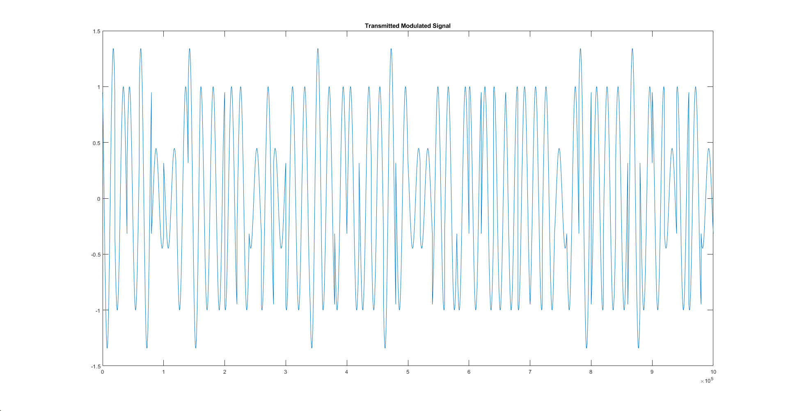
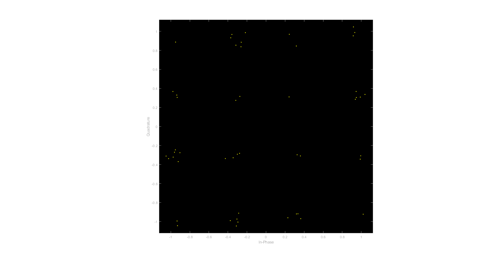

# EE304L Course Project

    Communication Systems 

## **Design of QAM system over the AWGN channel**

- ### **Problem Statement**

        QAM is a digital modulation technique which involves both the
        amplitude as well as phase shift keying. Write a matlab code to simulate
        QAM modulation. Plot the QAM modulated signal as well as the
        constellation diagram.

### **Team Members**

    EE20B007 Benstin Davis D 
    EE20B049 Venkatesa J
    EE20B051 Vignesh S

### **Plots**

- #### **Carrier**

    

- #### **Constellation Diagram**

    

- #### **Transmitted Signal**

    

- #### **Received symbols with noise**

    
